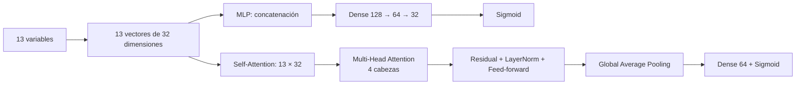

Predicción de la deserción estudiantil con MLP y Self-Attention

Proyecto de Deep Learning para predecir el abandono estudiantil a partir de
datos tabulares. Se comparan un **Multilayer Perceptron (MLP)** y un
**Self-Attention model** con el mismo preprocesamiento, particiones y protocolo
de evaluación.

El objetivo no es automatizar decisiones sobre estudiantes, sino evaluar si
estas arquitecturas pueden servir como apoyo para identificar casos que podrían
requerir acompañamiento temprano.

## Contenido del proyecto

- `JC_proyecto_desercion_mlp.ipynb`: carga y exploración de los datos,
  preprocesamiento, construcción de las redes, entrenamiento, evaluación y
  análisis de los pesos de atención.
- `Project_AP (2).pdf`: informe académico con metodología, arquitectura,
  resultados, discusión y conclusiones.
- `salidas_proyecto_desercion/`: carpeta generada al ejecutar el notebook con
  el modelo, el preprocesamiento, los umbrales y las tablas de resultados.

El archivo de datos utilizado por la ejecución de referencia es
`datos_desercion_fiscal_v3_500k_con_ruido.csv`. El dataset no se incluye en este
repositorio.

## Datos

La ejecución final utilizó 500.000 registros:

| Clase | Registros | Proporción |
|---|---:|---:|
| No abandono | 484.300 | 96,86 % |
| Abandono | 15.700 | 3,14 % |

Después de excluir `id_estudiante` y la columna constante
`tipo_institucion`, se utilizaron trece variables: ocho numéricas y cinco
categóricas.

Los datos se dividieron de forma estratificada:

- 70 % para entrenamiento.
- 15 % para validación.
- 15 % para prueba.

Los imputadores, escaladores y codificadores se ajustan exclusivamente con
entrenamiento para evitar fuga de información.

## Arquitecturas

Cada variable se representa mediante un vector de 32 dimensiones. Las variables
numéricas utilizan proyecciones `Dense` independientes y las categóricas
utilizan `Embedding`.



### Multilayer Perceptron

La MLP concatena los trece vectores en una representación de 416 componentes y
los procesa mediante capas densas de 128, 64 y 32 unidades. Utiliza ReLU,
`BatchNormalization`, `Dropout` y una salida `sigmoid`. La arquitectura
contiene 65.761 parámetros.

### Self-Attention model

El segundo modelo conserva las variables como tokens y aplica cuatro cabezas de
Self-Attention. Cada cabeza aprende relaciones mediante `Query`, `Key` y
`Value`. La salida incorpora conexiones residuales, `LayerNormalization`, una
red `feed-forward`, `GlobalAveragePooling1D` y una salida `sigmoid`. La
arquitectura contiene 12.225 parámetros.

No se utiliza codificación posicional porque las columnas no forman una
secuencia temporal y cada variable posee su propia proyección o `Embedding`.

## Entrenamiento

Ambos modelos utilizan:

- `BinaryCrossentropy`.
- Optimizador Adam con tasa inicial de aprendizaje de `1e-3`.
- Pesos de clase para compensar el desbalance.
- `EarlyStopping` monitoreando `val_pr_auc`.
- `ReduceLROnPlateau`.
- Tamaño de lote de 1024.

La MLP recuperó los pesos de la época 18, donde alcanzó un PR-AUC de validación
de 0,8039. El Self-Attention model recuperó los pesos de la época 5, con PR-AUC
de validación de 0,7989.

## Resultados

Los umbrales se seleccionaron exclusivamente en validación maximizando F1 y
después se aplicaron al conjunto de prueba.

| Modelo | Umbral | Precision | Recall | F1 | PR-AUC | ROC-AUC |
|---|---:|---:|---:|---:|---:|---:|
| MLP | 0,9197 | 0,8103 | 0,7707 | 0,7900 | 0,8064 | 0,9486 |
| Self-Attention model | 0,9515 | 0,8051 | 0,7682 | 0,7862 | 0,8036 | 0,9491 |

En los 75.000 registros de prueba:

- La MLP detectó 1.815 de los 2.355 abandonos, omitió 540 y produjo 425
  falsas alertas.
- El Self-Attention model detectó 1.809 abandonos, omitió 546 y produjo 438
  falsas alertas.

La MLP presentó una ventaja pequeña pero consistente en las métricas enfocadas
en la clase positiva. Por ello, se seleccionó como modelo preferido. El
mecanismo de atención no produjo una mejora práctica sobre la línea base.

## Interpretación de la atención

Con trece variables, un peso uniforme sería aproximadamente:

```text
1 / 13 = 0,0769
```

`inasistencia_anual_pct` recibió el mayor peso medio, con 0,0861. Las demás
variables permanecieron cerca de la referencia uniforme, por lo que no apareció
una jerarquía fuerte.

Los pesos de atención describen asociaciones internas del modelo. No demuestran
que una variable cause el abandono.

## Ejecución

Se recomienda utilizar Google Colab con GPU.

```python
# Instalar dependencias si es necesario
!pip -q install pandas openpyxl scikit-learn tensorflow matplotlib joblib pyarrow
```

Abra `JC_proyecto_desercion_mlp.ipynb`, configure la ubicación del dataset:

```python
FILE_PATH = Path("/ruta/datos_desercion_fiscal_v3_500k_con_ruido.csv")
```

Después ejecute todas las celdas en orden. El notebook generará los resultados y
guardará los artefactos en `salidas_proyecto_desercion/`.

## Dependencias principales

- Python 3.10 o posterior.
- TensorFlow 2.15.
- pandas.
- NumPy.
- scikit-learn.
- Matplotlib.
- joblib.
- PyArrow.

## Limitaciones

La evaluación corresponde a una partición aleatoria y a una sola semilla. Antes
de utilizar el modelo en un entorno real se requiere validación temporal,
validación con instituciones no observadas, calibración de las puntuaciones y
evaluación de equidad por subgrupos.

El modelo debe utilizarse como apoyo para orientar intervenciones de
acompañamiento y nunca como mecanismo autónomo para clasificar, excluir o
sancionar estudiantes.

## Autora

Janeth Castillo  
Universidad San Francisco de Quito  
Julio de 2026
Predicción de la deserción estudiantil con MLP y Self-Attention

Proyecto de Deep Learning para predecir el abandono estudiantil a partir de
datos tabulares. Se comparan un **Multilayer Perceptron (MLP)** y un
**Self-Attention model** con el mismo preprocesamiento, particiones y protocolo
de evaluación.

El objetivo no es automatizar decisiones sobre estudiantes, sino evaluar si
estas arquitecturas pueden servir como apoyo para identificar casos que podrían
requerir acompañamiento temprano.

## Contenido del proyecto

- `JC_proyecto_desercion_mlp.ipynb`: carga y exploración de los datos,
  preprocesamiento, construcción de las redes, entrenamiento, evaluación y
  análisis de los pesos de atención.
- `Project_AP (2).pdf`: informe académico con metodología, arquitectura,
  resultados, discusión y conclusiones.
- `salidas_proyecto_desercion/`: carpeta generada al ejecutar el notebook con
  el modelo, el preprocesamiento, los umbrales y las tablas de resultados.

El archivo de datos utilizado por la ejecución de referencia es
`datos_desercion_fiscal_v3_500k_con_ruido.csv`. El dataset no se incluye en este
repositorio.

## Datos

La ejecución final utilizó 500.000 registros:

| Clase | Registros | Proporción |
|---|---:|---:|
| No abandono | 484.300 | 96,86 % |
| Abandono | 15.700 | 3,14 % |

Después de excluir `id_estudiante` y la columna constante
`tipo_institucion`, se utilizaron trece variables: ocho numéricas y cinco
categóricas.

Los datos se dividieron de forma estratificada:

- 70 % para entrenamiento.
- 15 % para validación.
- 15 % para prueba.

Los imputadores, escaladores y codificadores se ajustan exclusivamente con
entrenamiento para evitar fuga de información.

## Arquitecturas

Cada variable se representa mediante un vector de 32 dimensiones. Las variables
numéricas utilizan proyecciones `Dense` independientes y las categóricas
utilizan `Embedding`.


### Multilayer Perceptron

La MLP concatena los trece vectores en una representación de 416 componentes y
los procesa mediante capas densas de 128, 64 y 32 unidades. Utiliza ReLU,
`BatchNormalization`, `Dropout` y una salida `sigmoid`. La arquitectura
contiene 65.761 parámetros.

### Self-Attention model

El segundo modelo conserva las variables como tokens y aplica cuatro cabezas de
Self-Attention. Cada cabeza aprende relaciones mediante `Query`, `Key` y
`Value`. La salida incorpora conexiones residuales, `LayerNormalization`, una
red `feed-forward`, `GlobalAveragePooling1D` y una salida `sigmoid`. La
arquitectura contiene 12.225 parámetros.

No se utiliza codificación posicional porque las columnas no forman una
secuencia temporal y cada variable posee su propia proyección o `Embedding`.

## Entrenamiento

Ambos modelos utilizan:

- `BinaryCrossentropy`.
- Optimizador Adam con tasa inicial de aprendizaje de `1e-3`.
- Pesos de clase para compensar el desbalance.
- `EarlyStopping` monitoreando `val_pr_auc`.
- `ReduceLROnPlateau`.
- Tamaño de lote de 1024.

La MLP recuperó los pesos de la época 18, donde alcanzó un PR-AUC de validación
de 0,8039. El Self-Attention model recuperó los pesos de la época 5, con PR-AUC
de validación de 0,7989.

## Resultados

Los umbrales se seleccionaron exclusivamente en validación maximizando F1 y
después se aplicaron al conjunto de prueba.

| Modelo | Umbral | Precision | Recall | F1 | PR-AUC | ROC-AUC |
|---|---:|---:|---:|---:|---:|---:|
| MLP | 0,9197 | 0,8103 | 0,7707 | 0,7900 | 0,8064 | 0,9486 |
| Self-Attention model | 0,9515 | 0,8051 | 0,7682 | 0,7862 | 0,8036 | 0,9491 |

En los 75.000 registros de prueba:

- La MLP detectó 1.815 de los 2.355 abandonos, omitió 540 y produjo 425
  falsas alertas.
- El Self-Attention model detectó 1.809 abandonos, omitió 546 y produjo 438
  falsas alertas.

La MLP presentó una ventaja pequeña pero consistente en las métricas enfocadas
en la clase positiva. Por ello, se seleccionó como modelo preferido. El
mecanismo de atención no produjo una mejora práctica sobre la línea base.

## Interpretación de la atención

Con trece variables, un peso uniforme sería aproximadamente:

```text
1 / 13 = 0,0769
```

`inasistencia_anual_pct` recibió el mayor peso medio, con 0,0861. Las demás
variables permanecieron cerca de la referencia uniforme, por lo que no apareció
una jerarquía fuerte.

Los pesos de atención describen asociaciones internas del modelo. No demuestran
que una variable cause el abandono.

## Ejecución

Se recomienda utilizar Google Colab con GPU.

```python
# Instalar dependencias si es necesario
!pip -q install pandas openpyxl scikit-learn tensorflow matplotlib joblib pyarrow
```

Abra `JC_proyecto_desercion_mlp.ipynb`, configure la ubicación del dataset:

```python
FILE_PATH = Path("/ruta/datos_desercion_fiscal_v3_500k_con_ruido.csv")
```

Después ejecute todas las celdas en orden. El notebook generará los resultados y
guardará los artefactos en `salidas_proyecto_desercion/`.

## Dependencias principales

- Python 3.10 o posterior.
- TensorFlow 2.15.
- pandas.
- NumPy.
- scikit-learn.
- Matplotlib.
- joblib.
- PyArrow.

## Limitaciones

La evaluación corresponde a una partición aleatoria y a una sola semilla. Antes
de utilizar el modelo en un entorno real se requiere validación temporal,
validación con instituciones no observadas, calibración de las puntuaciones y
evaluación de equidad por subgrupos.

El modelo debe utilizarse como apoyo para orientar intervenciones de
acompañamiento y nunca como mecanismo autónomo para clasificar, excluir o
sancionar estudiantes.

## Autora

Janeth Castillo  
Universidad San Francisco de Quito  
Julio de 2026
